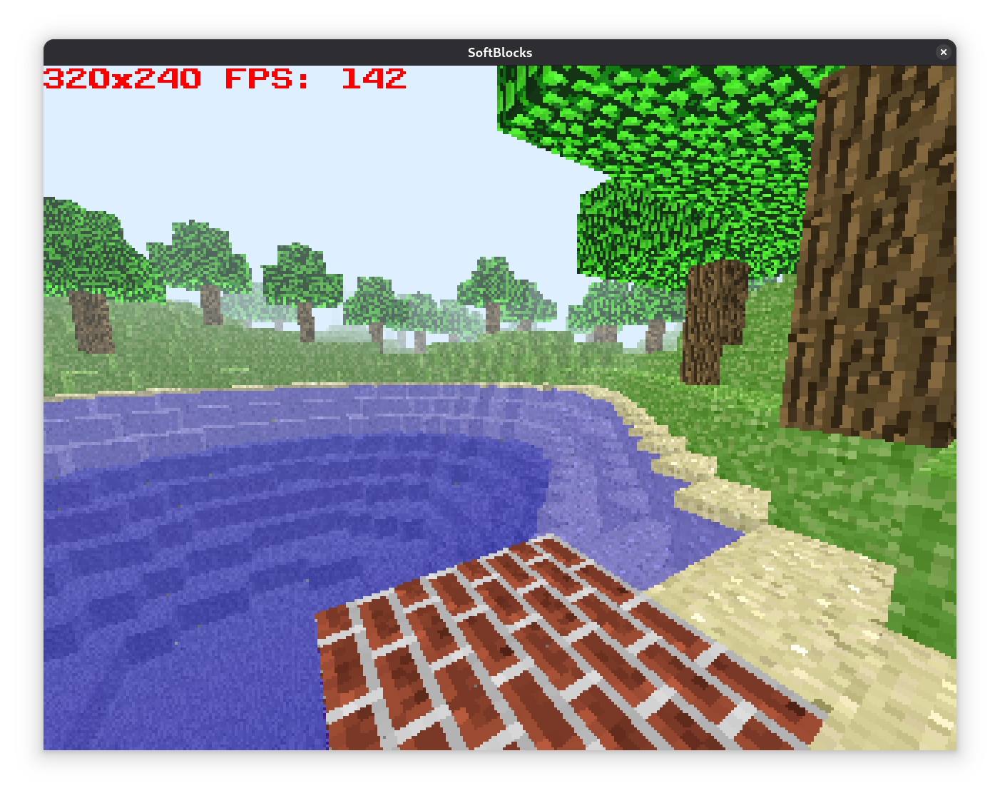

# SoftBlocks

Este programa é um programa que utiliza a técnica de *raytracing* para
renderizar por software uma cena 3d com voxels. Além disso, ele também utiliza
o *OpenMP* para paralelizar o processo, permitindo que haja otimizações.

Este programa está distribuído sob a licença GNU GPLv3+.



# Compilação e execução

São necessárias as seguintes dependências:
- SDL2
- SDL2\_image
- SDL2\_ttf
- cmake
- g++
- openmp
- git

Clone este repositório no seu computador e acesse sua pasta. Depois disso,
digite no seu terminal:

```
$ cmake -B build
$ cd build && make
$ cd ..
$ ./build/softblocks
```

O programa irá rodar adequadamente. O programa necessita do arquivo de imagens
para rodar, que aqui é chamado de *textures.png*.

# Controles

O programa os seguintes controles:

```
W - andar para frente
S - andar para trás
A - andar para esquerda
D - andar para direita
espaço - pular
mouse - movimentar a câmera
botão direito do mouse - remover bloco
botão esquerdo do mouse - colocar bloco
1-9 - escolher bloco
```

# Funcionamento

O software funciona com base no algoritmo de raytracing: para cada pixel da
cena, um raio é disparado da câmera para a cena. Esse raio procura a primeira
intersecção com o mapa, neste caso, o mapa em cubos (voxels) do jogo. Como cada
raio disparado é responsável individualmente pelos cálculos da intersecção e
também o cálculo da cor do pixel, é possível paralelizar esse processo
utilizando o OpenMP. 

Alguns pixels demorarão mais tempo para computar do que outros, por isso, utilizei
o schedule *dynamic*, já que utilizar o estático levaria a uma perda de performance.
A função `Raytracer::processPixel` é a função responsável por processar a cor
e as intersecções de cada pixel, ou seja, ela que é paralelizada. No código:

```
	#pragma omp parallel for collapse(2) private(i) schedule(dynamic, 64) 
	for(j = 0; j < SCREEN_HEIGHT; j++) {
		for(i = 0; i < SCREEN_WIDTH; i++) {
			processPixel(i, j);
		}
	}
```
